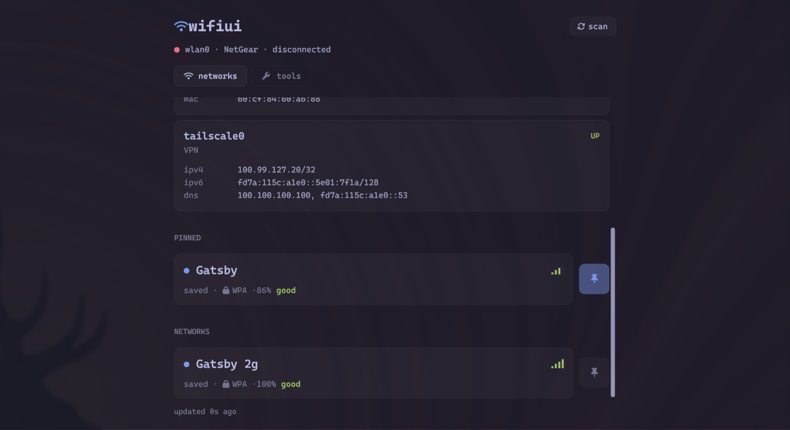
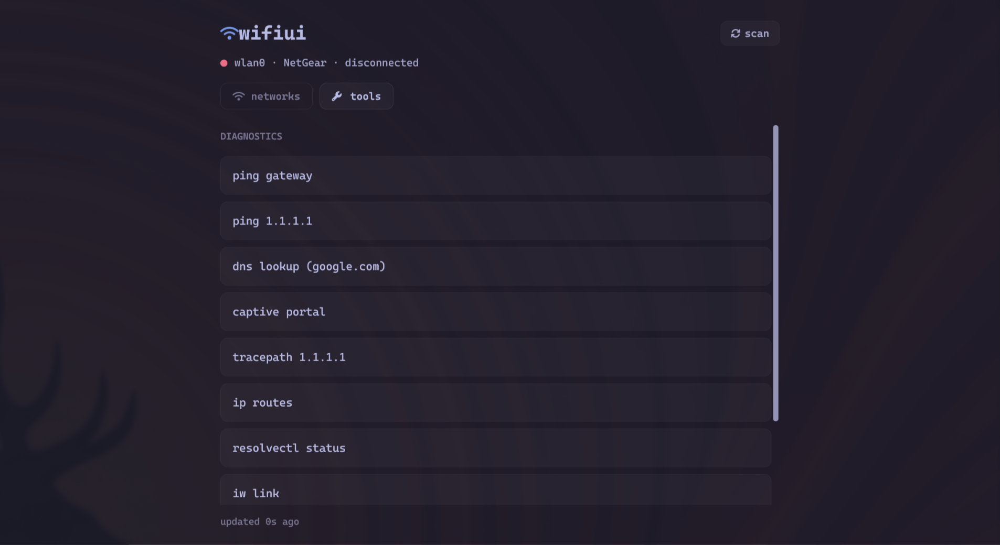

# wifiui

A small, opinionated Wi-Fi GUI for Linux, built on top of [iwd](https://iwd.wiki.kernel.org/) and [Gio](https://gioui.org/).

Designed to feel native on tiling window managers (Hyprland, Sway) — keyboard-first, monospace, themeable.

|  Networks                                              |  Diagnostics                                       |
| :----------------------------------------------------: | :------------------------------------------------: |
|          |            |

## Features

- Browse, scan, and connect to nearby networks via iwd's D-Bus API.
- **1Password integration** — auto-fills saved passphrases and offers to save new ones to your vault (via the `op` CLI).
- **Pinned networks** — keep your usual Wi-Fis at the top of the list.
- **Live connection panel** — IPv4/IPv6, gateway, DNS, DHCP lease expiry, link rate, Wi-Fi generation (4/5/6/7).
- **Captive-portal detection** with one-click "open in browser".
- **Diagnostics tab** — ping, dns lookup, tracepath, `ip route`, `resolvectl status`, `iw link`.
- **Omarchy theming** — picks up the active [Omarchy](https://omarchy.org/) palette and hot-reloads on change.
- **`wifictl`** — a small companion CLI for headless / SSH workflows.

## Requirements

- Linux with [iwd](https://iwd.wiki.kernel.org/) running as the Wi-Fi backend (replaces wpa_supplicant)
- Vulkan headers (build-time only; Gio uses Vulkan on Linux)
- A [Nerd Font](https://www.nerdfonts.com/) for the glyphs (Caskaydia/JetBrains Mono recommended)
- Optional: [`op`](https://1password.com/downloads/command-line/) (1Password CLI) for passphrase autofill/save
- Optional: `xdg-utils` for the captive-portal "open in browser" button

## Install

One-liner — downloads the latest release and installs to `~/.local/bin`:

```sh
curl -fsSL https://raw.githubusercontent.com/lewispb/wifiui/main/script/install | bash
```

Pin a version with `WIFIUI_VERSION=v1.2.3`. The installer verifies SHA256 against the release's `SHA256SUMS` and warns if `iwd` or `libvulkan.so.1` are missing.

On Omarchy systems, the installer also adds a `custom/wifiui` waybar module with a launcher icon. Skip with `WIFIUI_SKIP_WAYBAR=1`.

Uninstall: `rm ~/.local/bin/wifiui ~/.local/bin/wifiui-launch ~/.local/share/applications/wifiui.desktop`.

## Build from source

```sh
make setup    # installs vulkan headers via pacman or apt
make build    # produces bin/wifiui and bin/wifictl
make install  # installs to ~/.local/bin and adds a .desktop entry
```

Or with Go directly:

```sh
go build -o bin/ ./cmd/...
```

## Running

```sh
wifiui                  # launch the GUI
wifictl scan            # scan and list networks
wifictl connect <ssid>  # connect (prompts for passphrase on a tty)
wifictl status
wifictl disconnect
```

## Configuration

| Env var              | Effect                                                      |
|----------------------|-------------------------------------------------------------|
| `WIFIUI_OP_ACCOUNT`  | `op --account` shorthand for 1Password (omit to use default) |

Pinned-network state is stored at `~/.config/wifiui/pins.json`.

## Architecture

```
cmd/wifiui          Gio application entry point
cmd/wifictl         CLI companion

internal/iwd        iwd D-Bus client (Client / Station / Network) + agent
internal/netinfo    netlink + /sys + resolvectl + iw snapshot of active interfaces
internal/portal     captive-portal probe (detectportal.firefox.com)
internal/onepw      `op` CLI wrapper
internal/pins       JSON-backed pinned-SSID store
internal/theme      Omarchy palette loader + Material theme bundle
internal/wifi       shared band-classification helper
internal/ui         Gio UI (App, model, passphrase prompt, tools panel, networks tab)
```

The UI uses an immutable `viewState` published via `atomic.Pointer`: workers build a fresh state and `Store` it, layout reads with `Load` and treats it as read-only — no per-frame allocations on the read path.

## Status

Personal project. Works on my machine (Arch + Hyprland). Should work on any iwd-based Linux. PRs welcome.

## Licence

MIT — see [LICENSE](LICENSE).
